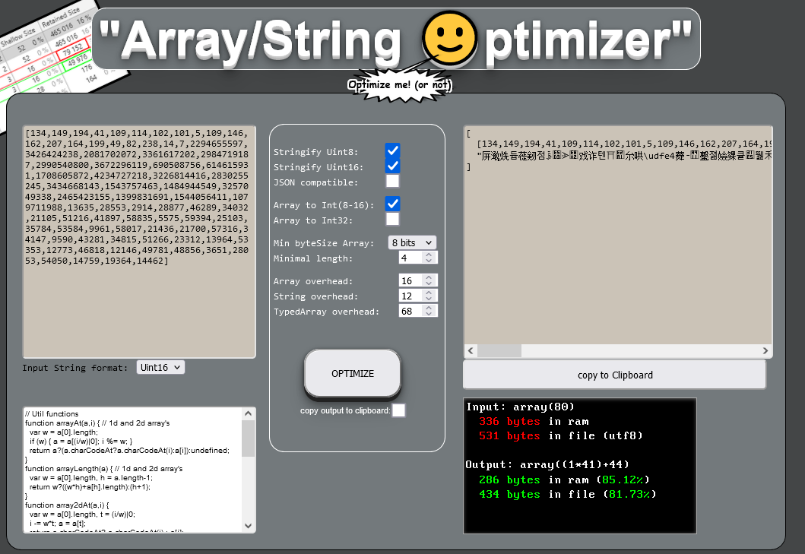

# ArrayOptimiser Tool


# What is this tool for?

Let's take an array that looks like this:
```javascript
var arr1 = [1,2,3,4,5,6,7, 1000000]
```

In memory each element will be stored on 32 bits (PACKED_ELEMENTS)
If we decompose this array into two sub-arrays we get:
```javascript
var arr2 = [[1,2,3,4,5,6,7], // PACKED_SMI_ELEMENTS (int8_t)
            [1000000]] // PACKED_ELEMENTS (int32_t)
```

In terms of size we get (knowing that we need to add the size of the header of the tables themselves):
- arr1 = (8 * 4bytes = 32 bytes) + (1 x 16bytes = 16 bytes)
- arr2 = (7 * 1byte + 1 * 4bytes = 11 bytes) + (3 x 16bytes = 48 bytes)

TOTAL:
- arr1 = 48 bytes
- arr2 = 59 bytes ⭕❌⭕❌ (very bad) <br><br>

# Conclusion and tips
- Worth for large arrays with large variance
- In javascript the String object is the smallest container for data's !<br><br>

# Usage
Here are the functions to access the 2d table, they are provided in 2 versions:
- 1D and 2D
```javascript
function arrayAt(a,i) { // 1d and 2d array's (slow)
  var w = a[0].length;
  if (w) { a = a[(i/w)|0]; i %= w; }
  return a?(a.charCodeAt?a.charCodeAt(i):a[i]):undefined;
}
function arrayLength(a) { // 1d and 2d array's (slow)
  var w = a[0].length, h = a.length-1;
  return w?((w*h)+a[h].length):(h+1);
}
```

- 2D only
```javascript
function array2dAt(a,i) {
  var w = a[0].length, t = (i/w)|0;
  i -= w*t; a = a[t];
  return a.charCodeAt? a.charCodeAt(i) : a[i];
}
function array2dLength(a) {
  var w = a[0].length, h = a.length-1;
  return w*h + a[h].length;
}
```

- Call
```javascript
for (var i = 0, len = array2dLength(arr2); i < len; i++) {
  console.log(array2dAt(arr2,i), " vs ", arr1[i]);
}
```
